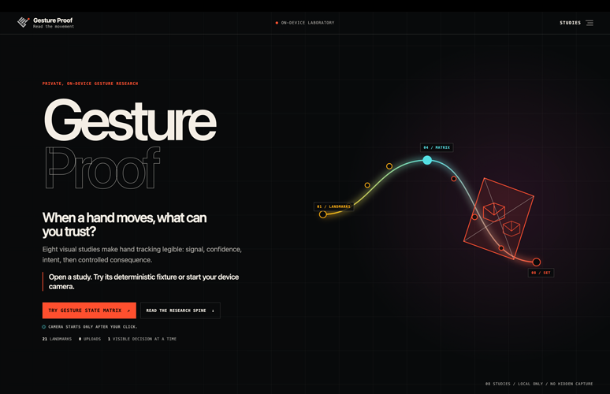
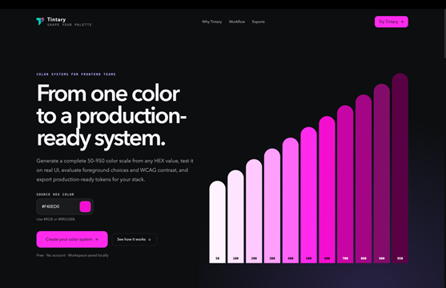
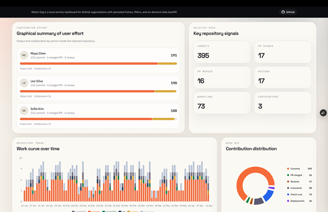
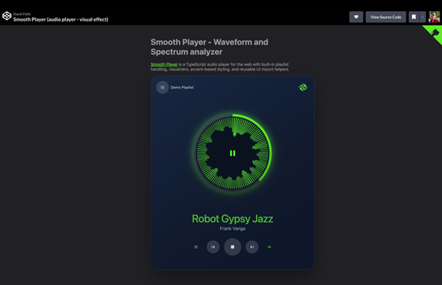
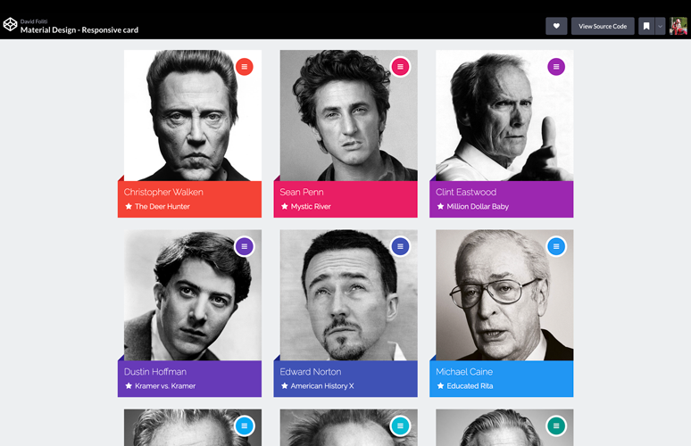

<h2>Lead Web Developer · Rome, Italy</h2>

I build <strong>web applications</strong>, <strong>developer tools</strong>, and <strong>browser experiments</strong>.

Most of my work revolves around TypeScript, React, Next.js, Node.js and AWS, 
with a focus on performance, maintainability, and building things that are actually useful.

---

## Selected work

<table>
<tr>
<td width="55%" valign="middle">

</td>
<td width="45%" valign="middle">

<h3><a href="https://github.com/marlenesco/gesture-proof">Gesture Proof</a></h3>

Browser experiments around <strong>gesture detection, interaction, movement, and effects</strong>.

Hand tracking and processing run on-device, directly in the browser.

<a href="https://marlenesco.github.io/gesture-proof/"><strong>Live demo →</strong></a> 
<a href="https://github.com/marlenesco/gesture-proof">Source code</a>

</td>
</tr>
</table>

<table>
<tr>
<td width="55%" valign="middle">

</td>
<td width="45%" valign="middle">

<h3><a href="https://tintary.app">Tintary</a></h3>

A free tool for building and experimenting with <strong>color systems</strong>.

Perceptual scales, semantic roles, contrast checks, and exports for CSS, Tailwind, Material UI, Bootstrap, and Tokens Studio.

<a href="https://tintary.app"><strong>Open Tintary →</strong></a>

</td>
</tr>
</table>

<table>
<tr>
<td width="55%" valign="middle">

</td>
<td width="45%" valign="middle">

<h3><a href="https://github.com/marlenesco/watch-org">Watch Org</a></h3>

A GitHub organization activity workspace built with <strong>Next.js, PostgreSQL, and a GitHub App</strong>.

Explore repositories, people, and development activity from locally synchronized GitHub data.

<a href="https://watch-org.vercel.app/repositories/pulse-web?range=90d&from=2026-01-13&to=2026-04-12&repository=pulse-web&user=all&activity=all&branch=all&org=demo-org"><strong>Live demo →</strong></a> 
<a href="https://github.com/marlenesco/watch-org">Source code</a>

</td>
</tr>
</table>

<table>
<tr>
<td width="55%" valign="middle">

</td>
<td width="45%" valign="middle">

<h3><a href="https://github.com/marlenesco/smooth-player">Smooth Player</a></h3>

A <strong>TypeScript audio player</strong> for the web with playlist handling, visualizers, theming, and reusable UI helpers.

Includes framework integrations for React, Vue, and Svelte.

<a href="https://codepen.io/marlenesco/full/JoKVaJx"><strong>Live demo →</strong></a> 
<a href="https://github.com/marlenesco/smooth-player">Source code</a>

</td>
</tr>
</table>

<table>
<tr>
<td width="55%" valign="middle">

</td>
<td width="45%" valign="middle">

<h3><a href="https://github.com/marlenesco/material-cards">Material Cards</a></h3>

A Material-inspired card component originally built with <strong>JavaScript and SCSS</strong>.

The project is now also exploring reusable React, Vue, and Svelte adapters.

<a href="https://codepen.io/marlenesco/full/NqOozj"><strong>Live demo →</strong></a> 
<a href="https://github.com/marlenesco/material-cards">Source code</a>

</td>
</tr>
</table>

 

> I like small projects that let me explore an idea without needing to turn everything into a product — browser APIs, UI experiments, developer tooling, visualization, and occasionally things that are simply fun to build.

---

## Tools I work with

<strong>Languages & runtime</strong>

  

<strong>Frameworks & web</strong>

  

<strong>Data & cloud</strong>

  

<strong>Infrastructure & tooling</strong>

 

<strong>A little more about me</strong>

 

I've been building for the web for a long time, but I still enjoy experimenting with new ideas and technologies outside my day-to-day work.

When I'm not writing code, I'm usually interested in **motorcycles, 3D printing, or drums**.

 

---

<strong>Build useful things. Experiment with the rest.</strong>

  

<a href="https://github.com/marlenesco">GitHub</a>
 ·  <a href="https://x.com/marlenesco">Twitter</a>
 ·  <a href="https://tintary.app">Tintary</a>

